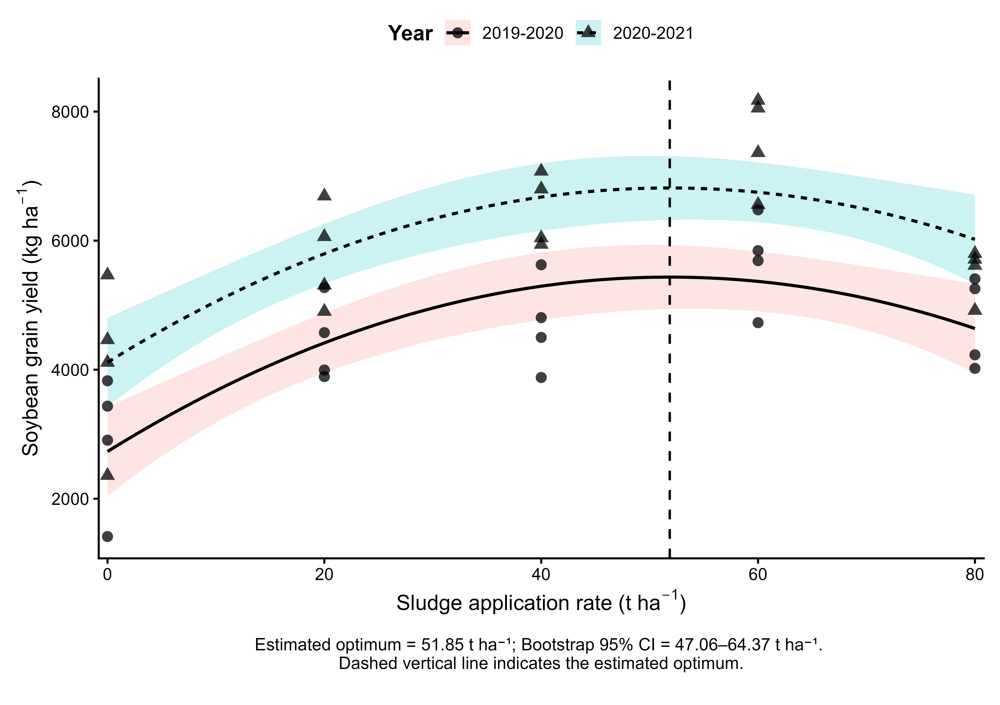

# Depth-dependent soil chemical responses and nonlinear crop productivity following poultry slaughterhouse sludge application
Data availability for reproducible results of scientific research

The R script `R Script/code` can be run to reproduce the results of the following study:

To run the script, you can run the R script under a R GUI such as RStudio.

## Data

Data can be found in the `dataset` folder. The folder includes the `.csv` files with raw data used in this study.

## Results

All the results are saved in the `Outputs` folder.

Figure 1: **The soybean grayn yield**.

Data and R script are available under the GNU General Public License version 3 (see `LICENSE` file).
